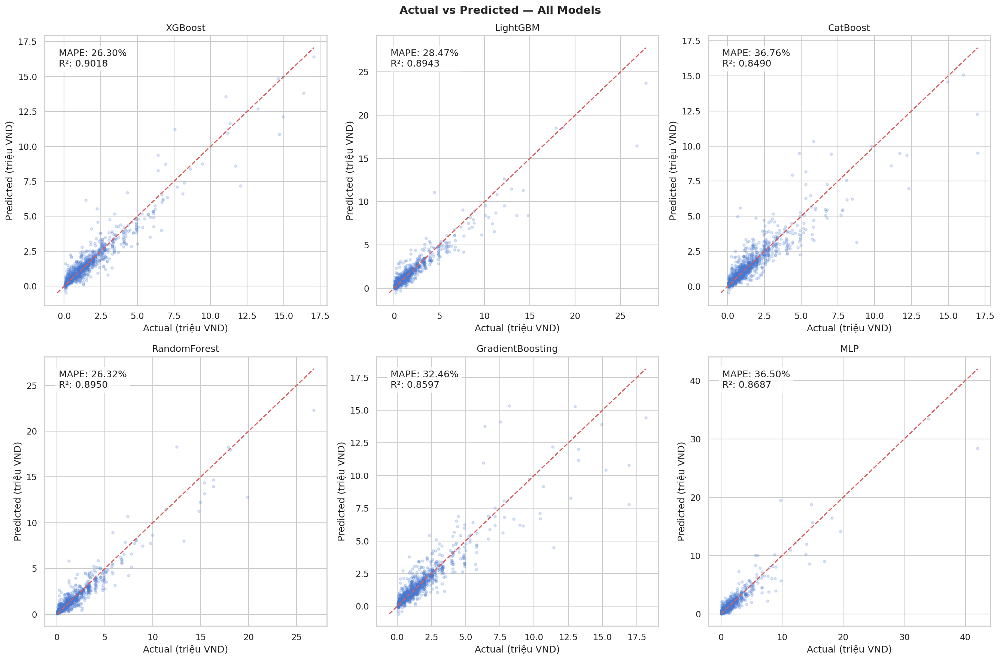
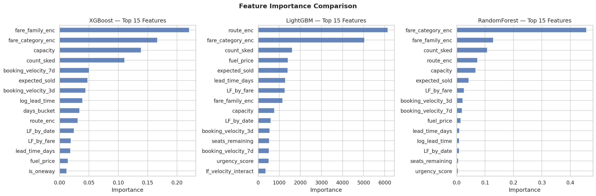
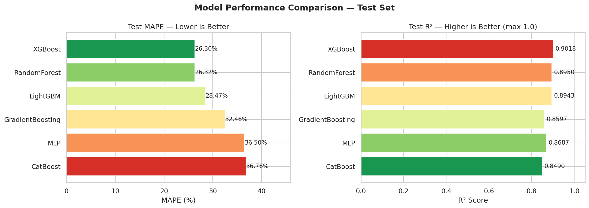
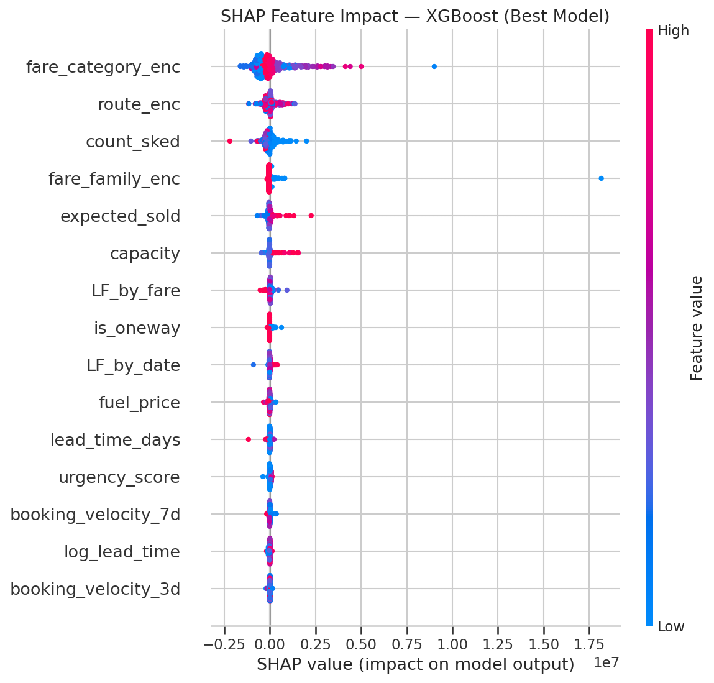
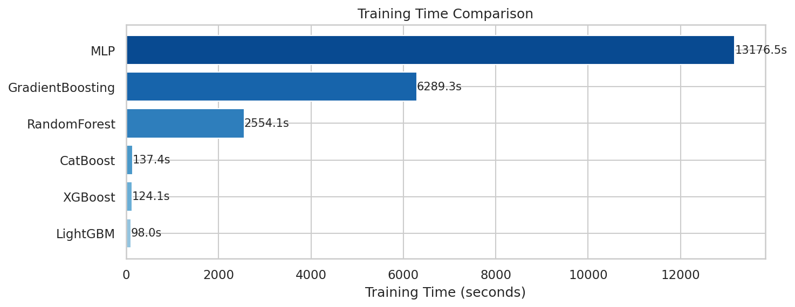

# VJ Hackathon Revenue Optimizer

Du doan gia ve va toi uu hoa doanh thu cho hang hang khong bang Machine Learning.

## Cau truc project

```
|-- kaggle/                      # ML TRAINING pipeline (train + save models)
|   |-- requirements.txt
|   |-- scripts/
|   |   |-- run_pipeline.py     # Full: load -> preprocess -> train -> visualize -> SHAP
|   |   |-- predict.py          # Inference script
|   |-- src/
|       |-- config.py           # Hyperparameters (6 models)
|       |-- data_loader.py      # Load CSV / Google Drive
|       |-- preprocessor.py     # Clean + feature engineering (NO leakage)
|       |-- trainer.py          # Train 6 models
|       |-- visualizer.py      # Charts
|       |-- shap_analysis.py   # SHAP analysis

|-- outputs/
|       |-- xgboost_model.pkl
|       |-- lightgbm_model.pkl
|       |-- catboost_model.pkl
|       |-- random_forest_model.pkl
|       |-- gradient_boosting_model.pkl
|       |-- mlp_model.pkl
|       |-- label_encoders.pkl
|       |-- imputation_values.pkl
|       |-- feature_names.txt
|       |-- model_comparison.csv
|       |-- final_report.json
```

## Luong hoat dong

```
TRAIN:  python kaggle/scripts/run_pipeline.py
            -> outputs/  (6 trained models)
```

## 6 Models

| Model | Mo ta |
|-------|-------|
| XGBoost | Gradient Boosting |
| LightGBM | Light Gradient Boosting |
| CatBoost | Categorical Boosting |
| RandomForest | Random Forest |
| GradientBoosting | Sklearn Gradient Boosting |
| MLP | Multi-layer Perceptron |

## Ket qua





